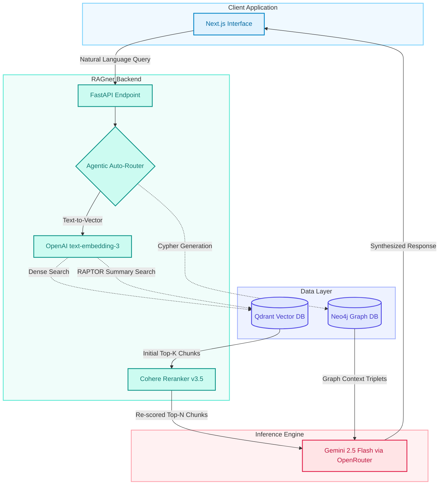
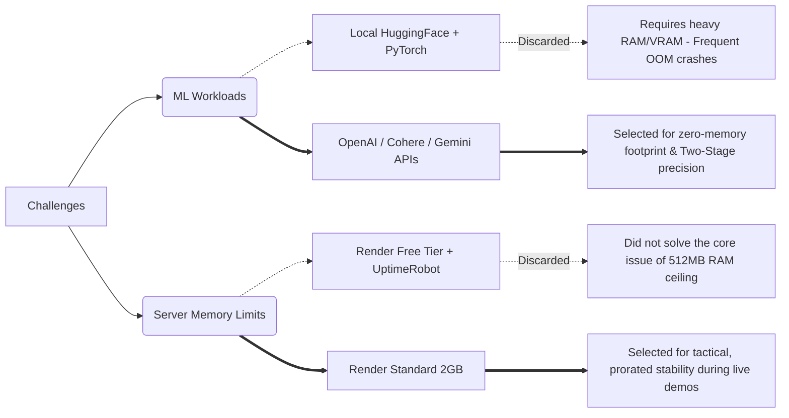

# Scaler ChatBOT (RAGner) Architecture & Decision Record

This document serves as a comprehensive technical post-mortem and architectural decision record (ADR) for the Scaler ChatBOT project. It details the full progression of the application—from early local prototyping using heavy open-source models to the final, highly optimized production state deployed on Render and Vercel.

## 1. System Architecture Overview (Production State)

The final production system operates on a decoupled architecture. It isolates heavy data ingestion processes from the retrieval pipeline and utilizes a fully cloud-native API stack (OpenAI, Cohere, OpenRouter) to execute Two-Stage Retrieval and generation without exhausting application server RAM.

## 2. The ML Infrastructure Evolution (Local Prototyping to Cloud APIs)

The most significant architectural shift occurred in how the pipeline handled machine learning workloads. The project evolved through two distinct phases to balance cost, retrieval precision, and hardware constraints.

### Phase 1: Local Prototyping (The 100% Local Stack)

During early development, the entire RAGner pipeline was designed to run locally.

* **The Strategy:** Both the embedding models (HuggingFace `all-MiniLM-L6-v2`) and the generation LLMs were loaded into local memory.
* **The Benefit:** This provided a completely free, private sandbox to build the complex routing logic (Vanilla Vector, RAPTOR, Knowledge Graph) without burning through paid API tokens during high-volume testing and debugging.

### Phase 2: The API Pivot (OpenAI + Cohere + Gemini)

When deploying to cloud servers, loading PyTorch and local LLMs caused immediate memory bottlenecks. To achieve production-grade performance on lightweight infrastructure, all heavy ML workloads were decoupled from the backend.

* **Embeddings & Reranking:** Migrated to `openai/text-embedding-3-small` for semantic vectorization and introduced `cohere/rerank-v3.5` to create a strict Two-Stage Retrieval system, drastically improving context precision.
* **Generation:** Offloaded to **Gemini 2.5 Flash** (via OpenRouter API) for blazing-fast, high-context reasoning.
* **The Result:** The FastAPI backend now acts purely as an orchestrator, keeping the architecture highly cost-efficient, lightning-fast, and immune to ML-induced memory crashes.

## 3. Key Engineering Decisions & Pivot Points

### Decision 1: Overcoming the 512MB RAM Ceiling (The Ingestion Pivot)

**Context:** Initial deployments on Render's Free/Starter tiers repeatedly crashed with `Out of memory (used over 512Mi)` errors.
**Analysis:** The backend was acting as both the ingestion engine and the retrieval engine. Libraries required for processing PDFs (`unstructured`, `pdf2image`) and RAPTOR clustering (`scikit-learn`, `umap-learn`) were bloating the runtime memory well beyond 512MB.
**Decision:** Decouple ingestion from retrieval.

* **Action:** Deleted the `/upload` endpoints and stripped the `requirements.txt` of all document parsing and clustering libraries.
* **Result:** Converted the production backend into a "read-only" retrieval engine, explicitly pointing to the pre-ingested files (`FDE_Brochure_.pdf`, `DSML_Brochure_2026.pdf`, etc.).

### Decision 2: The PyTorch Trap & Infrastructure Upgrade

**Context:** Even after stripping ingestion bloat, local embedding models required PyTorch (`torch`), which alone consumes roughly 1GB of RAM upon initialization.
**Decision:** A two-pronged approach for absolute stability: API migration + tactical hardware upgrade.

* **Action 1:** Rewrote the retrieval pipeline to use OpenAI APIs for embeddings and Cohere for reranking, completely removing `torch` and `sentence-transformers` from the dependency tree.
* **Action 2:** To guarantee absolute stability during the recruitment review window, the Render instance was upgraded to the Standard tier (\$25/mo, 2GB RAM). Because of prorated billing, this tactical upgrade ensures zero cold-start crashes for just ~$0.80/day.

### Decision 3: Qdrant Cloud Payload Indexing

**Context:** Queries referencing RAPTOR summaries or specific document filters failed in production with a `400 Bad Request` error.
**Analysis:** The local Docker instance of Qdrant allowed full table scans for filtering. However, Qdrant Cloud's strict performance safeguards blocked filtering across the 1,762 ingested points without explicit payload indexes.
**Decision:** Create permanent payload indexes directly on the cloud cluster.

* **Action:** Executed a local, one-off Python script utilizing `client.create_payload_index` for the `chunk_type` and `source` fields.
* **Result:** Enabled instantaneous metadata filtering in the cloud without requiring backend code modifications.

### Decision 4: Calibrating LLM Hallucination Guardrails

**Context:** The RAG pipeline initially refused to answer questions containing fragmented OCR text (e.g., "$2.5B Microsoft investment").
**Analysis:** The prompt engineering was too restrictive. Because the OCR parser extracted text without perfect proximity binding, the LLM could not mathematically prove the relationship without making an inference, hitting the fallback kill-switch.
**Decision:** Implement the "Educated Guess" protocol.

* **Action:** Softened the prompt to allow logical deductions, provided the LLM explicitly flags them by starting the response with `**[Educated Guess]**`.
* **Result:** The LLM successfully answered fragmented data queries while maintaining trustworthiness, successfully refusing completely out-of-scope questions (e.g., "how can I make my child learn ai").

## 4. Abandoned Execution Pathways

During development, several alternative pathways were considered but ultimately discarded to optimize for speed, stability, and professional presentation.

