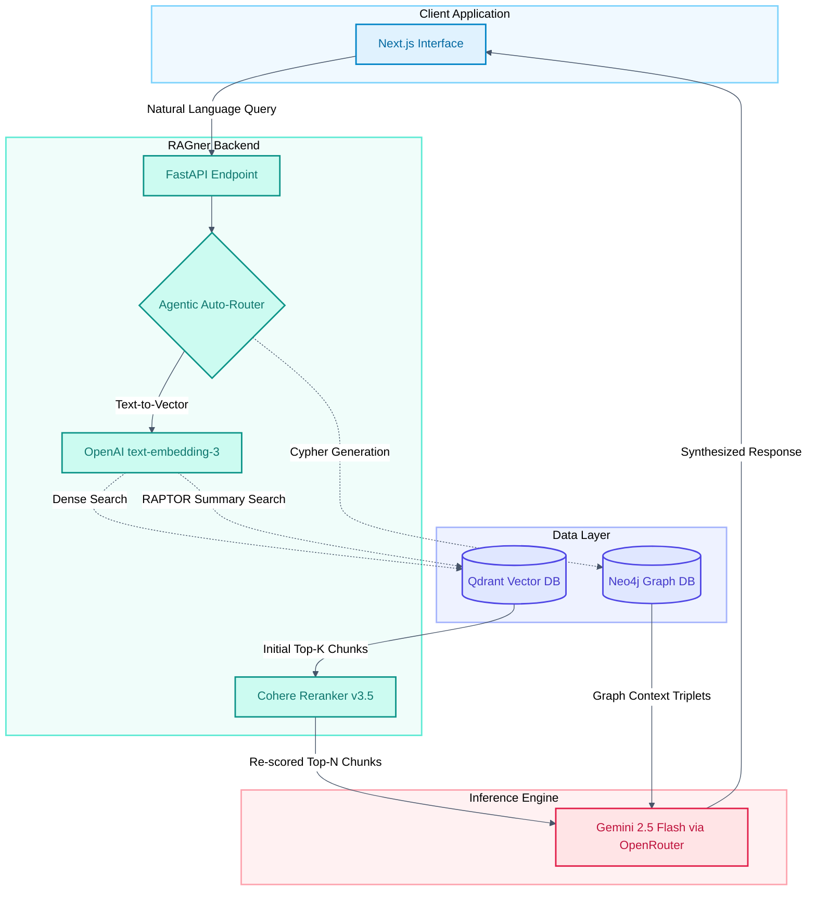

     

**RAGner** is a modular, production-ready framework designed to instantly transform any corpus of documents into a highly accurate, queryable AI agent. 

Rather than relying on basic semantic search, RAGner utilizes an **Agentic Auto-Router** that dynamically evaluates incoming queries and routes them through specialized retrieval engines: Vanilla Vector (with Two-Stage Reranking), RAPTOR (hierarchical summarization), and a Neo4j Knowledge Graph. 

By simply swapping out the source documents, RAGner can be instantly customized and deployed for any new client, use case, or industry.

---

## 🚀 Production Showcase: Scaler ChatBOT

To demonstrate the framework's capabilities, I deployed a customized instance of RAGner ingested specifically with technical documentation and course brochures from [Scaler](https://www.scaler.com/). 

* **Live Demo:** [🔗 scaler-chatbot-ragner.vercel.app](https://scaler-chatbot-ragner.vercel.app/)

---

## 🧠 Architectural Thought Process

Building a robust RAG system goes beyond wrapping an API call in a UI. RAGner was built to solve the core challenges of modern AI deployments: **Context Fragmentation**, **Multi-hop Reasoning**, and **Cloud Infrastructure Costs**.

### 1. Decoupled Ingestion & Retrieval
To keep cloud hosting costs near zero while maintaining high performance, the system architecture physically separates the ingestion pipeline from the retrieval API. Heavy libraries (like `unstructured`, `scikit-learn` and `umap-learn`) are used locally to parse PDFs, build RAPTOR trees, and extract graph entities. Once the vectors and graphs are pushed to the cloud, the production backend runs a highly optimized, lightweight environment, saving gigabytes of RAM.

### 2. Tri-Modal Retrieval Engines
Not all queries are created equal. RAGner utilizes three distinct retrieval methodologies:
* **Vanilla Vector Search (with Reranking):** For direct, factual queries (e.g., *"What is the duration of the course?"*). It uses a two-stage process: initial dense retrieval via Qdrant, followed by strict cross-encoder reranking.
* **Knowledge Graph (Neo4j):** For multi-hop reasoning across entities (e.g., *"Which instructors teach module X, and what companies are they from?"*).
* **RAPTOR (Tree-Organized Retrieval):** For holistic, thematic questions that span multiple documents (e.g., *"Summarize the core philosophy of the AI curriculum."*).

### 3. Agentic Routing & Graph Ontology
RAGner employs a smart routing layer that uses an LLM to classify user intent and direct the query to the correct retrieval engine. For Graph RAG, it dynamically generates a custom domain ontology during ingestion, ensuring the Knowledge Graph remains structured and queryable rather than shattering into synonymous relationships.

---

## 🏗️ System Architecture & Data Flow

---

## ⚙️ Models & Technologies Used

RAGner utilizes a state-of-the-art API stack to completely offload heavy ML workloads from the application server, allowing the backend to run on highly efficient, low-memory cloud tiers while delivering top-tier AI reasoning.

* **Frontend:** [Next.js (React)](https://nextjs.org/) customized for seamless chat interactions.
* **Backend:** [FastAPI](https://fastapi.tiangolo.com/) for high-throughput, asynchronous routing.
* **Embedding Model:** `openai/text-embedding-3-small` – Selected for highly semantic, cost-effective, and dimensionally optimized text vectorization.
* **Reranking Model:** `cohere/rerank-v3.5` – Implemented to cross-encode and re-score the initial vector retrieval, drastically improving context precision before passing it to the generator.
* **Generation Model:** `google/gemini-2.5-flash` (via OpenRouter) – Selected for its massive context window, blazing-fast inference speed, and high reasoning capabilities on complex/multi-hop tasks.
* **Vector Database:** [Qdrant Cloud](https://qdrant.tech/) with custom payload indexing for instant metadata filtering.
* **Graph Database:** [Neo4j AuraDB](https://neo4j.com/) utilizing Cypher query generation for dynamic entity traversal.

---

## 🛠️ A Peek into Usage (For Clients)

While this framework is designed to be highly customizable, the core usage pipeline is simple and plug-and-play:

1. **Data Drop:** Raw documents (PDFs) are ingested using high-resolution parsing to preserve tables and document structure.
2. **Intelligent Chunking:** The pipeline utilizes advanced recursive character splitting, explicitly keeping Markdown tables intact for pristine data retrieval.
3. **Multi-Dimensional Processing:**
    - Embeddings are generated and pushed to Qdrant.
    - The RAPTOR engine clusters (via K-Means or GMM) and summarizes the text into a hierarchical tree.
    - The Knowledge Graph builder uses fuzzy logic and canonicalization to extract clean Entity-Relationship triplets into Neo4j.

4. **Deploy:** The backend and frontend spin up, immediately ready to answer complex queries about the newly ingested corpus with strict hallucination guardrails.
---

***If you are interested in deploying a custom instance of RAGner for your enterprise data, please reach out via the contact information below.***

## 👨‍💻 Developer

**Saransh Saini** | *AI Engineer*
 

 
 
 
